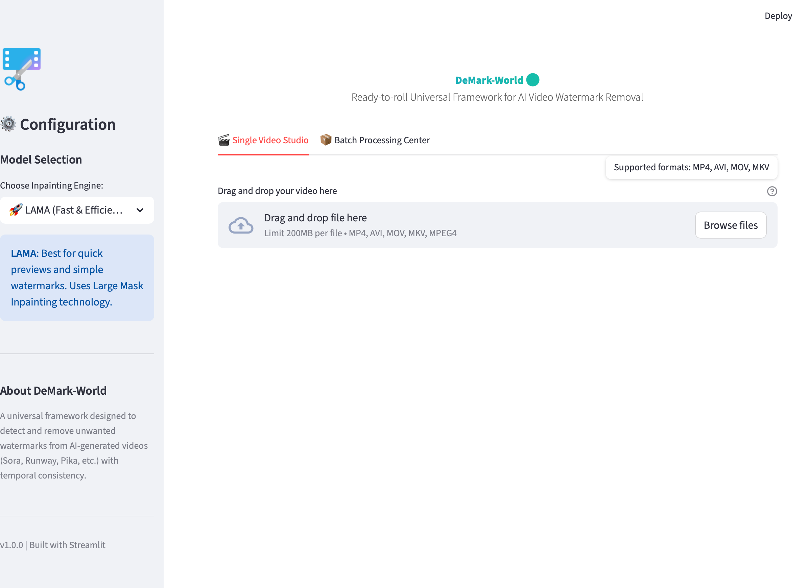

# 🌍 DeMark-World

**A Universal Framework for AI Video Watermark Removal**

**DeMark-World** is the evolution of [SoraWatermarkCleaner](https://github.com/linkedlist771/SoraWatermarkCleaner). While its predecessor focused on Sora, DeMark-World is a "ready-to-roll" universal framework designed to detect and remove unwanted watermarks from *any* AI-generated video (Sora, Runway, Pika, Kling, etc.) with high fidelity and temporal consistency.
> Prompt: a cat running in a forest.


<table>
  <tr>
    <td width="20%">
      <strong>Sora2</strong>
    </td>
    <td width="80%">
      <video src="https://github.com/user-attachments/assets/a92b99fc-a716-4f96-9963-feb85491e84b" 
             width="100%" controls></video>
    </td>
  </tr>
  <tr>
    <td>
      <strong>Google Veo3.1</strong>
    </td>
    <td>
      <video src="https://github.com/user-attachments/assets/de8b7f45-22ac-4871-b59b-9b5837f25432" 
             width="100%" controls></video>
    </td>
  </tr>
  <tr>
    <td>
      <strong>Ruanway Gen4</strong>
    </td>
    <td>
      <video src="https://github.com/user-attachments/assets/435d4888-539b-4670-b364-2a1ac7e211c9" 
             width="100%" controls></video>
    </td>
  </tr>
</table>


## ✨ Features

Moving beyond just Sora v2 in [SoraWatermarkCleaner](https://github.com/linkedlist771/SoraWatermarkCleaner), DeMark-World is engineered to handle watermarks from the latest generation of video models, including **Google Gemini/Veo**, **Runway Gen-3/Gen-4**, **Pika**, **Kling**, and **Luma Dream Machine**.

## 🛠️ Installation

**Prerequisites**: You must have [FFmpeg](https://ffmpeg.org/) installed and added to your system PATH.

We use **[uv](https://github.com/astral-sh/uv)** for project management. It is significantly faster and more reliable than pip/poetry.

1. **Clone the repository**

   Bash

   ```
   git clone https://github.com/linkedlist771/DeMark-World.git
   cd DeMark-World
   ```

2. **Install environment**

   ```
   # This creates the virtual environment and installs all dependencies
   uv sync
   ```

3. **Activate environment**

   ```
   # Linux/MacOS
   source .venv/bin/activate
   
   # Windows
   .venv\Scripts\activate
   ```

> **Note on Models**: Detector weights and Inpainting models will be downloaded automatically to the cache directory upon the first run.


## 🚀 Quick Start

### 1. Interactive Web UI (Recommended)

The easiest way to use DeMark-World is via the modern Streamlit interface.

Bash

```
streamlit run app.py
```

Then open your browser to `http://localhost:8501`.



### 2. Python API

You can integrate DeMark-World into your own pipelines easily.

Python

```
from pathlib import Path
from src.demark_world.core import DeMarkWorld
from src.demark_world.schemas import CleanerType

if __name__ == "__main__":
    input_video = Path("resources/Veo3_Cat_Running_In_Forest_Video.mp4")
    output_video: Path = Path("outputs/cleaned.mp4")

    # Option 1: LaMa (Fast)
    demarker = DeMarkWorld(cleaner_type=CleanerType.LAMA)
    
    # Option 2: E2FGVI_HQ (High Quality + Time Consistent)
    # demarker = DeMarkWorld(cleaner_type=CleanerType.E2FGVI_HQ)

    demarker.run(input_video, output_video)
```


## 🧠 How It Works

DeMark-World operates in a two-stage pipeline, it just works like in [SoraWatermarkCleaner](https://github.com/linkedlist771/SoraWatermarkCleaner).


## 📜 License


Distributed under the **Apache 2.0 License**. See `LICENSE` for more information.


## 🖊️ Citation

If you find this project helpful in your research or work, please cite:

```bash
@misc{DeMark-World2025,
  author = {linkedlist771},
  title = {DeMark-World},
  year = {2025},
  url = {https://github.com/linkedlist771/DeMark-World}
}
```

## 🙏 Acknowledgments

- For the incredible implementation of SOTA inpainting models.
- For the YOLO object detection framework.

---

💝 If you find this project helpful, please consider starring the repo!
